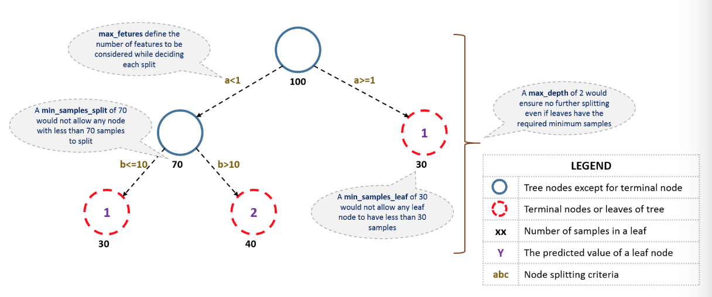

# (PART) 机器学习算法实例 {-}

# GBDT 算法的 Python 代码调参 {#gbdt-python}

本篇文章的原文为[Complete Machine Learning Guide to Parameter Tuning in Gradient Boosting (GBM) in Python](https://www.analyticsvidhya.com/blog/2016/02/complete-guide-parameter-tuning-gradient-boosting-gbm-python/)。

Bagging 只能控制模型的 variance，而 Boosting 算法可以控制模型 bias 和 variance 的平衡，因此，Boosting 在实际问题中可能效果更好。

**本文包含两个方面的内容：**

1. 理解 GBM 的参数 

2. GBM 参数调整实战

## GBM 参数

**GBM 的参数可以分为 3 类：**

1. Tree-Specific 参数：可以控制模型中的每棵树；

2. Boosting 参数：控制模型中的 boosting 操作；

3. Miscellaneous 参数：控制整体功能的参数。

### Tree-Specific 参数

首先看一下决策树的结构：



1. **min_sample_split**

  * 定义一个节点是否需要再分裂的样本（观察值）数量，比如上图中，定义的阈值为 70，如果节点样本数量小于 70，则这个节点就不能再继续分裂；
  * 控制过拟合。较高的值会阻碍模型学习特定的模式，该模式可以高度区分一棵树中的特定样本。
  * 此参数取值过高会导致欠拟合，应该使用交叉验证进行调整。

2. **min_samples_leaf**

  * 定义一个终端（叶子）节点的最小样本（观察值）数量，上图中定义的阈值为 30，叶子节点的最小样本不能少于 30；
  * 和 `min_sample_split`类似，控制过拟合。
  * 当针对不平衡分类问题时，会选取较低的值。
  
3. **min_weight_fraction_leaf**

  * 类似于`min_sample_leaf`，只不过定义的是叶子节点样本数量占总样本数量的比例；
  * `min_samples_leaf` 和 `min_weight_fraction_leaf` 只需要定义一个。
  
4. **max_depth**

  * 定义一棵树的最大深度；
  * 通常用来控制过拟合，高的深度会可以让模型学习特定样本的模式；
  * 需要使用交叉验证来调整。
  
5. **max_leaf_nodes**

  * 定义一棵树的最大终端（叶子）节点的数量；
  * 可以替代 `max_depth`，因为二叉树的性质，深度为 n 的的树最多有 $2^n$ 个叶子节点；
  * 如果这个参数被定义，GBM 会忽略参数 `max_depth`。
  
6. **max_features**

  * 搜索最好的分裂点需要考虑的特征数量。定义之后，将会随机选择特征；
  * 作为一个金手指法则，取特征总数量的平方根会有一个不错的效果，但是，我们会检验特征总数量的 30% ~ 40%；
  * 更高的值会导致过拟合，但依情况而定。
  
在介绍其它参数之前，可以先看一下 GBM 在二分类数据训练中的伪代码：

```
1. Initialize the outcome
2. Iterate from 1 to total number of trees
  2.1 Update the weights for targets based on previous run (higher for the ones mis-classified)
  2.2 Fit the model on selected subsample of data
  2.3 Make predictions on the full set of observations
  2.4 Update the output with current results taking into account the learning rate
3. Return the final output.
```

以上是 GBM 运行的简化解释。我们以上所介绍的参数只会影响步骤 2.2，下面引入其它的参数。

### Boosting 参数

1. **learning_rate**

  * 这个参数决定了每棵树在最终结果中产生的影响大小（步骤 2.4）。GBM 
  * 通常偏向于选择较小的值，因为它可以使模型对树的特定特征更具有健壮性。
  * 如果取值比较小，则将会需要更多的树来拟合所有的关系，计算量会非常大。
  
2. **n_estimators**  

  * 模型中有序树的数量（步骤 2）；
  * 虽然 GBM 在树的数量比较大时相对更加稳健，但是它仍有可能会产生过拟合。因此，在一个特定的 `learning_rate` 下需要通过交叉验证调整 `n_estimators`。
  
3. **subsample**

  * 每棵树中选择的观察值比例，通过随机抽样来选择；
  * 如果取值小于 1，模型通过减少 variance 会更加稳健；
  * 典型值 0.8 表现的不错，但是这个值仍然需要微调。
  
### Miscellaneous 参数

除了上面介绍的两类参数，还有其它的参数。

1. **loss**

  * 在每次分裂时需要最小化的损失函数；
  * 对于分类和回归的情况下有多种值可选。通常默认值表现不错，除非你了解其它值对模型的影响，否则尽量不用。
  
2. **init**

  * 影响输出的初始化；
  * 如果我们将另一个模型的输出结果作为 GBM 的初始估计，则可以使用它。
  
3. **random_state**

  * 随机数种子可以在每次运行中产生相同的随机数；
  * 在某一个特殊的随机样本挑选中，也存在潜在的过拟合。我们可以尝试不同的随机样本来运行模型，不过计算量太大，所以我们基本不会去做。
  
4. **verbose** 

  * 模型拟合后打印的输出类型，不同的值为：
    * 0：不会产生输出（默认）
    * 1：以某以间隔输出产生树
    * 大于 1：输出所有产生树
    
5. **warm_start**

  * 使用它可以在先前模型拟合的基础上拟合额外的树，它可以节省很多时间，可以去探索它。
  
6. **presort**

  * 选择是否为更快的分裂预排序数据；
  * 它使得选择默认自动化，但是如果需要的话可以改变。
  
## GBM 参数调整实战

**在进行 GBM 调参之前，我们已经完成了对数据的清理工作。**

我们导入需要的库并加载数据：

```python
import numpy as np
import pandas as pd
from sklearn.ensemble import GradientBoostingClassifier  # GBM 算法
from sklearn.model_selection import cross_val_score
from sklearn.model_selection import GridSearchCV
from sklearn import metrics

import matplotlib.pyplot as plt
%matplotlib inline
plt.rcParams['figure.figsize'] = 12, 4 

train = pd.read.csv('train_modified.csv')
target = 'Disbursed'
IDcol = 'ID'
```

在继续进行之前，我们先定义一个函数，可以帮助我们创建 GBM 模型，并且执行 cross-validation。

```python
def modelfit(alg, dtrain, predictors, performCV=True, printFeatureImportance=True, cv_folds=5):
    
```

  
  
模型默认参数

```python
GradientBoostingClassifier(loss='deviance', learning_rate=0.1, n_estimators=100, subsample=1.0, criterion='friedman_mse', min_samples_split=2, min_samples_leaf=1, min_weight_fraction_leaf=0.0, max_depth=3, min_impurity_decrease=0.0, min_impurity_split=None, init=None, random_state=None, max_features=None, verbose=0, max_leaf_nodes=None, warm_start=False, presort='deprecated', validation_fraction=0.1, n_iter_no_change=None, tol=0.0001, ccp_alpha=0.0)
```


  
  
  


