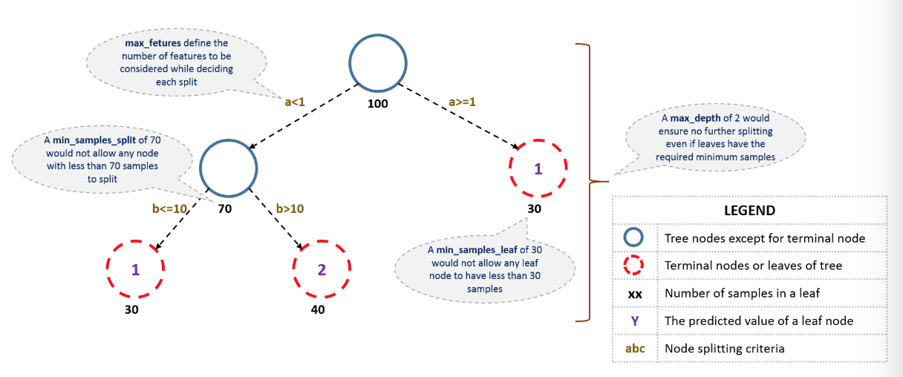

# (PART) 机器学习算法实例 {-}

# GBDT 算法 Python 代码调参 {#gbdt-python}

本篇文章的原文为[Complete Machine Learning Guide to Parameter Tuning in Gradient Boosting (GBM) in Python](https://www.analyticsvidhya.com/blog/2016/02/complete-guide-parameter-tuning-gradient-boosting-gbm-python/)。

Bagging 只能控制模型的 variance，而 Boosting 算法可以控制模型 bias 和 variance 的平衡，因此，Boosting 在实际问题中可能效果更好。

**本文包含两个方面的内容：**

1. 理解 GBM 的参数 

2. GBM 参数调整实战

## GBM 参数

**GBM 的参数可以分为 3 类：**

1. Tree-Specific 参数：可以控制模型中的每棵树；

2. Boosting 参数：控制模型中的 boosting 操作；

3. Miscellaneous 参数：控制整体功能的参数。

### Tree-Specific 参数

首先看一下决策树的结构：

```{r echo = FALSE, out.width = "100%", fig.align = 'center'}

```

1. **min_sample_split**

  * 定义一个节点是否需要再分裂的样本（观察值）数量，比如上图中，定义的阈值为 70，如果节点样本数量小于 70，则这个节点就不能再继续分裂；
  * 控制过拟合。较高的值会阻碍模型学习特定的模式，该模式可以高度区分一棵树中的特定样本。
  * 此参数取值过高会导致欠拟合，应该使用交叉验证进行调整。

2. **min_samples_leaf**

  * 定义一个终端（叶子）节点的最小样本（观察值）数量，上图中定义的阈值为 30，叶子节点的最小样本不能少于 30；
  * 和 `min_samples_split`类似，控制过拟合。
  * 当针对不平衡分类问题时，会选取较低的值。
  
3. **min_weight_fraction_leaf**

  * 类似于`min_samples_leaf`，只不过定义的是叶子节点样本数量占总样本数量的比例；
  * `min_samples_leaf` 和 `min_weight_fraction_leaf` 只需要定义一个。
  
4. **max_depth**

  * 定义一棵树的最大深度；
  * 通常用来控制过拟合，高的深度会可以让模型学习特定样本的模式；
  * 需要使用交叉验证来调整。
  
5. **max_leaf_nodes**

  * 定义一棵树的最大终端（叶子）节点的数量；
  * 可以替代 `max_depth`，因为二叉树的性质，深度为 n 的的树最多有 $2^n$ 个叶子节点；
  * 如果这个参数被定义，GBM 会忽略参数 `max_depth`。
  
6. **max_features**

  * 搜索最好的分裂点需要考虑的特征数量。定义之后，将会随机选择特征；
  * 作为一个金手指法则，取特征总数量的平方根会有一个不错的效果，但是，我们会检验特征总数量的 30% ~ 40%；
  * 更高的值会导致过拟合，但依情况而定。
  
在介绍其它参数之前，可以先看一下 GBM 在二分类数据训练中的伪代码：

```
1. Initialize the outcome
2. Iterate from 1 to total number of trees
  2.1 Update the weights for targets based on previous run (higher for the ones mis-classified)
  2.2 Fit the model on selected subsample of data
  2.3 Make predictions on the full set of observations
  2.4 Update the output with current results taking into account the learning rate
3. Return the final output.
```

以上是 GBM 运行的简化解释。我们以上所介绍的参数只会影响步骤 2.2，下面引入其它的参数。

### Boosting 参数

1. **learning_rate**
  * 这个参数决定了每棵树在最终结果中产生的影响大小（步骤 2.4）。GBM 
  * 通常偏向于选择较小的值，因为它可以使模型对树的特定特征更具有健壮性。
  * 如果取值比较小，则将会需要更多的树来拟合所有的关系，计算量会非常大。
  
2. **n_estimators**  

  * 模型中有序树的数量（步骤 2）；
  * 虽然 GBM 在树的数量比较大时相对更加稳健，但是它仍有可能会产生过拟合。因此，在一个特定的 `learning_rate` 下需要通过交叉验证调整 `n_estimators`。
  
3. **subsample**

  * 每棵树中选择的观察值比例，通过随机抽样来选择；
  * 如果取值小于 1，模型通过减少 variance 会更加稳健；
  * 典型值 0.8 表现的不错，但是这个值仍然需要微调。
  
### Miscellaneous 参数

除了上面介绍的两类参数，还有其它的参数。

1. **loss**

  * 在每次分裂时需要最小化的损失函数；
  * 对于分类和回归的情况下有多种值可选。通常默认值表现不错，除非你了解其它值对模型的影响，否则尽量不用。
  
2. **init**

  * 影响输出的初始化；
  * 如果我们将另一个模型的输出结果作为 GBM 的初始估计，则可以使用它。
  
3. **random_state**

  * 随机数种子可以在每次运行中产生相同的随机数；
  * 在某一个特殊的随机样本挑选中，也存在潜在的过拟合。我们可以尝试不同的随机样本来运行模型，不过计算量太大，所以我们基本不会去做。
  
4. **verbose** 

  * 模型拟合后打印的输出类型，不同的值为：
    * 0：不会产生输出（默认）
    * 1：以某以间隔输出产生树
    * 大于 1：输出所有产生树
    
5. **warm_start**

  * 使用它可以在先前模型拟合的基础上拟合额外的树，它可以节省很多时间，可以去探索它。
  
6. **presort**

  * 选择是否为更快的分裂预排序数据；
  * 它使得选择默认自动化，但是如果需要的话可以改变。
  
## GBM 参数调整实战

**在进行 GBM 调参之前，我们已经完成了对数据的清理工作。**

我们导入需要的库并加载数据：

```python
import numpy as np
import pandas as pd
from sklearn.ensemble import GradientBoostingClassifier  # GBM 算法
from sklearn.model_selection import cross_val_score
from sklearn.model_selection import GridSearchCV
from sklearn import metrics

import matplotlib.pyplot as plt
%matplotlib inline
plt.rcParams['figure.figsize'] = 12, 4 

train = pd.read.csv('train_modified.csv')
target = 'Disbursed'
IDcol = 'ID'
```

在继续进行之前，我们先定义一个函数，可以帮助我们创建 GBM 模型，并且执行 cross-validation。

```python
def modelfit(alg, dtrain, predictors, performCV=True, printFeatureImportance=True, cv_folds=5):
    #Fit the algorithm on the data
    alg.fit(dtrain[predictors], dtrain['Disbursed'])
        
    #Predict training set:
    dtrain_predictions = alg.predict(dtrain[predictors])
    dtrain_predprob = alg.predict_proba(dtrain[predictors])[:,1]
    
    #Perform cross-validation:
    if performCV:
        cv_score = cross_val_score(alg, dtrain[predictors], dtrain['Disbursed'], cv=cv_folds, scoring='roc_auc')
    
    #Print model report:
    print("\nModel Report")
    print("Accuracy : %.4g" % metrics.accuracy_score(dtrain['Disbursed'].values, dtrain_predictions))
    print("AUC Score (Train): %f" % metrics.roc_auc_score(dtrain['Disbursed'], dtrain_predprob))
    
    if performCV:
        print("CV Score : Mean - %.7g | Std - %.7g | Min - %.7g | Max - %.7g" % (np.mean(cv_score),np.std(cv_score),np.min(cv_score),np.max(cv_score)))
                
    #Print Feature Importance:
    if printFeatureImportance:
        feat_imp = pd.Series(alg.feature_importances_, predictors).sort_values(ascending=False)
        feat_imp.plot(kind='bar', title='Feature Importances')
        plt.ylabel('Feature Importance Score')    
```

模型默认参数

```python
GradientBoostingClassifier(loss='deviance', learning_rate=0.1, n_estimators=100, subsample=1.0, 
criterion='friedman_mse', min_samples_split=2, min_samples_leaf=1, min_weight_fraction_leaf=0.0, 
max_depth=3, min_impurity_decrease=0.0, min_impurity_split=None, init=None, random_state=None, 
max_features=None, verbose=0, max_leaf_nodes=None, warm_start=False, presort='deprecated', 
validation_fraction=0.1, n_iter_no_change=None, tol=0.0001, ccp_alpha=0.0)
```

## baseline 模型

我们首先创建一个 baseline 模型。一个好的 baseline 模型使用默认的 GBM 参数，即不用调整参数。如下：

```python
#Choose all predictors except target & IDcols
predictors = [x for x in train.columns if x not in [target, IDcol]]
gbm0 = GradientBoostingClassifier(random_state=10)
modelfit(gbm0, train, predictors)
```

```{r echo = FALSE, out.width = "75%", fig.align = 'center'}

```

所以，平均 CV 得分为 0.8319，我们想模型结果比这个更好。

## 参数调节的一般方法

在以上讨论中，有两种参数可以调节—— **tree-based 和 boosting 参数**。假设我们可以训练足够多的树，则对于 learning rate 没有最优值，因为总是越低的值表现越好。

虽然随着训练树的增加，GBM 足够稳健而不会过拟合，但是，对于一个比较高的 learning rate 可以导致过拟合。我们可以减小 learning rate 和增加 tree 的数量，但是，这又会导致在个人电脑上计算量比较大而花费过多的时间。

我们可以采用以下的步骤：

1. 选择一个相对 **较高的 learning rate**。通常默认值 0.1 可以运行的不错，但是对不同的问题，我们可以选择 0.05 ~ 0.2 之间的值；
2. 在这个 **learning rate** 下确定 **最优的树的数量**。这个最好是在 40~70 之间。记住，选择一个可以在你的系统上运行比较快的值，这是因为它将被用来测试大量的场景并且决定树的参数；
3. 在 **learning rate** 和 **树的数量** 确定的情况下，**调整 tree-specific 参数**。
4. **降低 learning rate** 并且按比例的增加估计器的数量得到更加稳健的模型。

### 固定 learning rate 和 估计器（树）的数量，调整 tree-based 参数

为了决定 boosting 参数，我们需要设定一些其它参数的初始值。首先取下面的值：

1. **min_samples_split = 500**：这个通常设置为大约总样本的 0.5~1%. 由于本章涉及到的是类不平衡问题，因此我们选择此范围中比较小的值。

2. **min_samples_leaf = 50**：可以基于直觉选择。这个变量用来防止过拟合，对于这里类不平衡问题，我们仍然选择一个小一点的值。

3. **max_depth = 8**：基于观察值和预测变量的数量来作选择（一般为 5~8）。文章样本有 87K 行，49 列，我们这里取值为 8。

4. **max_features = 'sqrt'**：初始值使用平方根通常是一个金法则。

5. **subsample = 0.8**：这是一个通常使用的初始值。

> 注意：上面列出的都是初始值，后面将会作调整。

这里我们取 learning rate 为 0.1（默认值），得到最优的树的数量。为了得到树的数量，我们对其进行网格搜索。

```python
#Choose all predictors except target & IDcols
predictors = [x for x in train.columns if x not in [target, IDcol]]
param_test1 = {'n_estimators':range(20, 81, 10)}
gsearch1 = GridSearchCV(estimator = GradientBoostingClassifier(learning_rate=0.1, min_samples_split=500,
                                  min_samples_leaf=50, max_depth=8, max_features='sqrt', subsample=0.8, random_state=10), 
                       param_grid = param_test1, scoring='roc_auc', n_jobs=4, iid=False, cv=5)
gsearch1.fit(train[predictors], train[target])
```

```python
gsearch1.best_params_, gsearch1.best_score_, gsearch1.best_index_

# 输出值
({'n_estimators': 60}, 0.8393875216177697, 4)
```

可以看到，在 learning rate 为 0.1 的情况下我们得到最优树的数量为 60。在这里指出，60 是一个通常使用的合理的值，但是在其它案例中可能不会得到同样的值。

1. 如果得到的值为 20 左右，可能你需要将 learning rate 降低到 0.05，然后重新运行网格搜索；

2. 如果得到的值太高（比如大约 100），调参的过程将会很耗时，你可以使用一个比较高的学习率。

### 调整 tree-specific 参数

调整 based-tree 的参数，可以按照下面的步骤：

1. 调整 max_depth 和 num_samples_split
2. 调整 min_samples_leaf
3. 调整 max_features

调整参数的顺序要小心决定。你应该首先选择对输出结果有更高影响力的参数，例如，max_depth 和 min_samples_split。

> 重要通知：可以根据自己的机器和系统来调整需要网格搜索的参数数量。

我们首先将 max_depth 设置为区间 5~15 上，步长为 2，设置 min_samples_split 区间为 200 ~ 1000，步长为 200。这些是基于直觉设定的，你也可以先设置更大的范围，然后在更小的范围上进行多次迭代。

```python
#Grid seach on max_depth and min_samples_split
param_test2 = {'max_depth':range(5,16,2), 'min_samples_split':range(200,1001,200)}
gsearch2 = GridSearchCV(estimator = GradientBoostingClassifier(learning_rate=0.1, n_estimators=60, 
                        min_samples_leaf=50, max_features='sqrt', subsample=0.8, random_state=10), 
                       param_grid = param_test2, scoring='roc_auc', n_jobs=4, iid=False, cv=5)
gsearch2.fit(train[predictors],train[target])

gsearch2.best_params_, gsearch2.best_score_, gsearch2.best_index_ 
# 输出结果
({'max_depth': 7, 'min_samples_split': 1000}, 0.8390202547430871, 9)
```

我们运行了 30 对混合参数，得到理想的值 max_depth 为 7，min_samples_split 为 1000。其中，1000 是我们在上面设置的极值，有可能最优的值会比它大，所以我们应该测试一下更高的值。

这里，我们选定 max_depth 为 7，而且在选取更高的 min_samples_split 时也不再改变 max_depth 的值。虽然这不是最理想的情况，但是在这里的问题上可以看出它是一个比较合理的值。同时，我们测试 min_samples_leaf 的 5 个值。

> 如果可以看到每一组参数下的交叉验证结果会比较好，这样我们就可以查看某一个确定参数值下，其它参数变化时最终的交叉验证结果。

```python
#Grid seach on min_samples_split and min_samples_leaf
param_test3 = {'min_samples_split':range(1000,2100,200), 'min_samples_leaf':range(30,71,10)}
gsearch3 = GridSearchCV(estimator = GradientBoostingClassifier(learning_rate=0.1, n_estimators=60,max_depth=7,
                                                    max_features='sqrt', subsample=0.8, random_state=10), 
                       param_grid = param_test3, scoring='roc_auc',n_jobs=4,iid=False, cv=5)
gsearch3.fit(train[predictors],train[target])

gsearch3.best_params_, gsearch3.best_score_
# 输出结果
({'min_samples_leaf': 70, 'min_samples_split': 1000}, 0.84018902830047)

modelfit(gsearch3.best_estimator_, train, predictors)
```

我们得到最优值 min_samples_split 为 1000，min_samples_leaf 为 70。再者，我们可以看到 CV 得分现在为 0.84019。

```{r echo = FALSE, out.width = "75%", fig.align = 'center'}
knitr::include_graphics("images/ml_example_gbdt/3.png")
```

如果将这个模型与 baseline 模型比较特征重要性，可以看到，我们可以从其它变量中得到一些信息。当然，之前的模型将太多的重要性施加到某些变量上，现在分布的比较均匀。

现在，我们调整最后的 tree-based 参数 max_features。

```python
#Grid seach on max_features
param_test4 = {'max_features':range(5,20,2)}
gsearch4 = GridSearchCV(estimator = GradientBoostingClassifier(learning_rate=0.1, n_estimators=60, max_depth=7, 
                            min_samples_split=1000, min_samples_leaf=70, subsample=0.8, random_state=10),
                       param_grid = param_test4, scoring='roc_auc', n_jobs=4, iid=False, cv=5)
gsearch4.fit(train[predictors],train[target])

gsearch4.best_params_, gsearch4.best_score_
# 输出结果
({'max_features': 7}, 0.84018902830047)
```

这里，我们发现最优值为 7，刚好是平方根，所以我们设置的初始值就是最好的。现在，我们有最后的 tree-based 的参数的结果：

* min_samples_split：1000
* min_samples_leaf：70
* max_depth：7
* max_features：7

### 调整 subsample，并且运行更低的 learning rate 下的模型

我们将测试不同的 subsample 值：

```python
#Grid seach on subsample 
param_test5 = {'subsample':[0.6,0.7,0.75,0.8,0.85,0.9]}
gsearch5 = GridSearchCV(estimator = GradientBoostingClassifier(learning_rate=0.1, n_estimators=60, 
                                    max_depth=7, min_samples_split=1000, min_samples_leaf=70, 
                                    subsample=0.8, random_state=10, max_features=7),
                       param_grid = param_test5, scoring='roc_auc', n_jobs=4, iid=False, cv=5)
gsearch5.fit(train[predictors],train[target])

gsearch5.best_params_, gsearch5.best_score_
# 输出结果
({'subsample': 0.8}, 0.84018902830047)
```

我们发现最优值为 0.8。最后，我们有所有需要的参数了。现在，我们需要降低 leanring rate，并且成比例的增加估计器（树）的数量。需要注意，这些树可能不是最优的值，但是是一个好的测试。

随着树的增加，执行 cross validation 和找到最优值是非常耗时的。

首先将 learning rate 减半，即 0.05，然后增加树的数量到 120。

```python
#Choose all predictors except target & IDcols
predictors = [x for x in train.columns if x not in [target, IDcol]]
gbm_tuned_1 = GradientBoostingClassifier(learning_rate=0.05, n_estimators=120,max_depth=7, min_samples_split=1000, 
                                         min_samples_leaf=70, subsample=0.80, random_state=10, max_features=7)
modelfit(gbm_tuned_1, train, predictors)
```

```{r echo = FALSE, out.width = "75%", fig.align = 'center'}
knitr::include_graphics("images/ml_example_gbdt/4.png")
```

我们可以将 learning rate 减小到原来的 1/10，即 0.01，然后训练 600 棵树。

```python
#Choose all predictors except target & IDcols
predictors = [x for x in train.columns if x not in [target, IDcol]]
gbm_tuned_2 = GradientBoostingClassifier(learning_rate=0.01, n_estimators=600,max_depth=7, min_samples_split=1000, 
                                         min_samples_leaf=70, subsample=0.80, random_state=10, max_features=7)
modelfit(gbm_tuned_2, train, predictors)
```

```{r echo = FALSE, out.width = "75%", fig.align = 'center'}
knitr::include_graphics("images/ml_example_gbdt/5.png")
```

将 learning rate 减小到原来的 1/20，然后训练 1200 棵树。

```python
#Choose all predictors except target & IDcols
predictors = [x for x in train.columns if x not in [target, IDcol]]
gbm_tuned_3 = GradientBoostingClassifier(learning_rate=0.005, n_estimators=1200,max_depth=7, min_samples_split=1000, 
                                         min_samples_leaf=70, subsample=0.80, random_state=10, max_features=7,
                                         warm_start=True)
modelfit(gbm_tuned_3, train, predictors, performCV=False)
```

```{r echo = FALSE, out.width = "75%", fig.align = 'center'}
knitr::include_graphics("images/ml_example_gbdt/6.png")
```

将 learning rate 减到非常小，训练 1500 棵树。

```python
#Choose all predictors except target & IDcols
predictors = [x for x in train.columns if x not in [target, IDcol]]
gbm_tuned_4 = GradientBoostingClassifier(learning_rate=0.005, n_estimators=1500,max_depth=7, min_samples_split=1000, 
                                         min_samples_leaf=70, subsample=0.80, random_state=10, max_features=7,
                                         warm_start=True)
modelfit(gbm_tuned_4, train, predictors, performCV=False)
```

```{r echo = FALSE, out.width = "75%", fig.align = 'center'}
knitr::include_graphics("images/ml_example_gbdt/7.png")
```

另一个技巧是使用 GBM 的 `warm_start` 参数。你可以使用它以小步长的增加估计器的数量来测试不同的值，而不用总是从头开始。

## 结语

**上面所有的代码和结果只是通过在测试集上，或者进行全样本度量，或者进行交叉验证得到的。其最终的结果应该在测试集上进行验证。**


  
  
  


