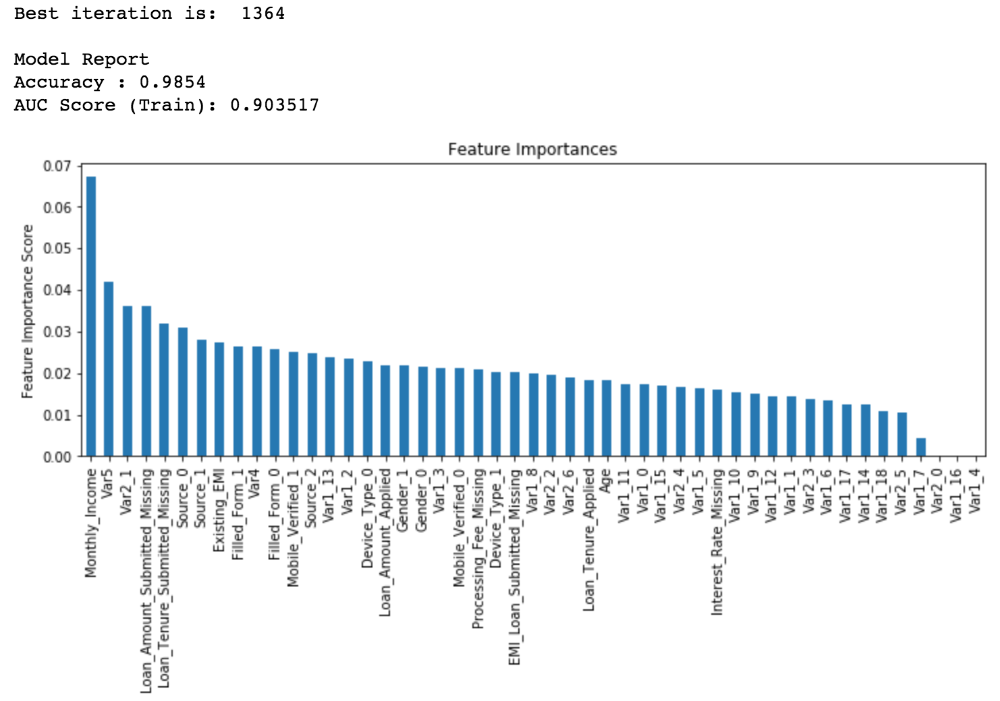

# XGBoost 算法 Python 代码调参

本篇文章是从 [Complete Guide to Parameter Tuning in XGBoost with codes in Python](https://www.analyticsvidhya.com/blog/2016/03/complete-guide-parameter-tuning-xgboost-with-codes-python/) 翻译而来，因为文章是几年前的，所以其中有一点点代码作了修改。而且作者建议再看这篇文章之前最好先看一下 [Complete Guide to Parameter Tuning in Gradient Boosting (GBM) in Python](https://www.analyticsvidhya.com/blog/2016/02/complete-guide-parameter-tuning-gradient-boosting-gbm-python/)。下面我们还是先对 XGBoost 进行分析总结。

## XGBoost 优点

XGBoost算法可以给预测模型带来能力的提升。当我对它的表现有更多了解的时候，当我对它的高准确率背后的原理有更多了解的时候，我发现它具有很多优势：

1、正则化  

标准GBM的实现没有像XGBoost这样的正则化步骤。正则化对减少过拟合也是有帮助的。 实际上，XGBoost以“正则化提升(regularized boosting)”技术而闻名。

2、并行处理  

XGBoost可以实现并行处理，相比GBM有了速度的飞跃。 不过，众所周知，Boosting算法是顺序处理的，它怎么可能并行呢？每一课树的构造都依赖于前一棵树，那具体是什么让我们能用多核处理器去构造一个树呢？我希望你理解了这句话的意思。 XGBoost 也支持Hadoop实现。

3、高度的灵活性

XGBoost 允许用户定义自定义优化目标和评价标准 它对模型增加了一个全新的维度，所以我们的处理不会受到任何限制。

4、缺失值处理

XGBoost内置处理缺失值的规则。 用户需要提供一个和其它样本不同的值，然后把它作为一个参数传进去，以此来作为缺失值的取值。XGBoost在不同节点遇到缺失值时采用不同的处理方法，并且会学习未来遇到缺失值时的处理方法。

5、剪枝

当分裂时遇到一个负损失时，GBM会停止分裂。因此GBM实际上是一个贪心算法。 XGBoost会一直分裂到指定的最大深度(max_depth)，然后回过头来剪枝。如果某个节点之后不再有正值，它会去除这个分裂。 这种做法的优点，当一个负损失（如-2）后面有个正损失（如+10）的时候，就显现出来了。GBM会在-2处停下来，因为它遇到了一个负值。但是XGBoost会继续分裂，然后发现这两个分裂综合起来会得到+8，因此会保留这两个分裂。

6、内置交叉验证

XGBoost允许在每一轮boosting迭代中使用交叉验证。因此，可以方便地获得最优boosting迭代次数。 而GBM使用网格搜索，只能检测有限个值。

7、在已有的模型基础上继续

XGBoost可以在上一轮的结果上继续训练。这个特性在某些特定的应用上是一个巨大的优势。 sklearn中的GBM的实现也有这个功能，两种算法在这一点上是一致的。

## XGBoost 参数介绍

在运行 XGBoost 之前，我们必须设置三类参数：

1. 通用参数：进行宏观控制

2. Booster 参数：在每一步控制 booster 

3. 学习任务参数：

### 通用参数

1. booster（默认 gbtree）

可以是 gbtree，gblinear 或者 dart，gbtree 和 dart 为基于 tree 的模型，而 gblinear 为线性模型。

2. verbosity（默认 1）

打印信息，0：silent，1：warning，2：info，3：debug

3. nthread（如果没有设置，默认为最大线程数）

运行 XGBoost 的并行线程的数量

### Tree Booster 参数

1. eta（默认 0.3，别名：learning_rate）

* 通过设定每一次迭代的权重来提高模型的 robust；

* 取值范围 [0, 1]

2. gamma（默认 0，别名：min_split_loss）

* 在节点分裂时，当损失减少超过 gamma 时，才进行分裂。这个参数越大，算法越保守。

* 取值范围：[0, +Inf)

3. max_depth（默认 6）

* 树的最大深度，深度越大，模型越复杂，并且更可能会过拟合。

* 取值范围：[0, +Inf)

4. min_child_weight（默认 1）

* 决定最小叶子节点样本权重和。 和GBM的 min_child_leaf 参数类似，但不完全一样。XGBoost的这个参数是最小样本权重的和，而GBM参数是最小样本总数。 这个参数用于避免过拟合。当它的值较大时，可以避免模型学习到局部的特殊样本。 但是如果这个值过高，会导致欠拟合。这个参数需要使用CV来调整。

5. max_delta_step（默认 0）

* 这参数限制每棵树权重改变的最大步长。如果这个参数的值为0，那就意味着没有约束。如果它被赋予了某个正值，那么它会让这个算法更加保守。 通常，这个参数不需要设置。但是当各类别的样本十分不平衡时，它对逻辑回归是很有帮助的。 这个参数一般用不到，但是你可以挖掘出来它更多的用处。

6. subsample（默认 1）

* 控制每棵树随机采样的比例。减小这个参数值，算法会更加保守，避免过拟合。如果设置的太小，可能导致欠拟合。

* 通常选择范围：0.5 ~ 1

7. colsample_bytree, colsample_bylevel, colsample_bynode（默认 1）

* colsample_bytree 控制每棵树随机采样的特征的占比。通常选择范围：0.5 ~ 1

* colsample_bylevel 控制树的每一级的每一次分裂，对列数的采样的占比，一般不太用，因为 subsample 和 colsample_bytree 可以起到同样的作用。

8. lambda（默认 1，别名：reg_lambda）

* 权重的 L2 正则化项。

9. alpha（默认 0，别名：reg_alpha）

* 权重的 L1 正则化项，可以用在很高维的情况下，算法速度更快。

10. scale_pos_weight（默认 1）

在各类别样本十分不平衡时，把这个参数设定为一个正值，可以使算法更快收敛。

### 学习任务参数

用来控制理想的优化目标和每一步结果的度量方法。

1. objective（默认 reg:squarederror），指定最小化的目标函数。

* reg:squarederror：针对回归的平方损失

* reg:logistic：Logisitic 回归

* multi:softmax：使用 softmax 目标函数来做多分类，此时也需要设置 num_class

还有其它[几种目标函数](https://xgboost.readthedocs.io/en/latest/parameter.html)


2. eval_metric（根据选择的 objective 有不同的默认值）

3. seed（默认 0）

随机数的种子，可以复现随机数据的结果。


## XGBoost 实例调参

我们在这一节所针对的问题可以在 [Data Hackathon 3.x](https://datahack.analyticsvidhya.com/contest/data-hackathon-3x/) 上面找到，数据可以在[这里下载](https://www.analyticsvidhya.com/wp-content/uploads/2016/02/Dataset.rar)。本篇文章代码可以在[这里下载](https://github.com/aarshayj/analytics_vidhya/tree/master/Articles/Parameter_Tuning_XGBoost_with_Example)下面我们使用的数据是经过预处理的，旨在将重点放在调参的过程。

先导入模块和加载数据：

```python
import numpy as np
import pandas as pd
import xgboost as xgb
from xgboost.sklearn import XGBClassifier
from sklearn.model_selection import cross_validate
from sklearn.model_selection import GridSearchCV
from sklearn import metrics

import matplotlib.pyplot as plt
%matplotlib inline
plt.rcParams['figure.figsize'] = (12, 4)

train = pd.read.csv('train_modified.csv')
test = pd.read.csv('test_modified.csv')
target = 'Disbursed'
IDcol = 'ID'
```

这里可以看到导入了两种形式的 XGBoost：

1. xgboost：这是一个直接的 xgboost 库，我们将会使用这个库中的一个专门函数 cv 来找出迭代的最佳次数，因为这个函数在每次迭代都会进行交叉验证。

2. XGBClassifier：这是 XGBoost 的 sklearn 接口，我们可以使用 sklearn 的 GridSearchCV 来进行参数调优。

在继续进行之前，定义一个可以帮助我们创建 XGBoost 模型和执行 cross-validation 的函数，这个函数可以用到自己以后的模型中。

```python
# test_result.csv 文件不存在，它是测试集的结果
# test_results = pd.read_csv('test_results.csv')
def modelfit(alg, dtrain, dtest, predictors, useTrainCV=True, cv_folds=5, early_stopping_rounds=50): 
    # 这一步的作用是在给定条件下，找出最佳的 estimator 的数量
    if useTrainCV:
        xgb_param = alg.get_xgb_params()
        xgtrain = xgb.DMatrix(dtrain[predictors].values, label=dtrain[target].values)
        xgtest = xgb.DMatrix(dtest[predictors].values)
        # 在每一轮都进行交叉验证，最后选取最好的 estimator 的数量，这一步是关键
        cvresult = xgb.cv(xgb_param, xgtrain, num_boost_round=alg.get_params()['n_estimators'], nfold=cv_folds,
            metrics='auc', early_stopping_rounds=early_stopping_rounds)
        alg.set_params(n_estimators=cvresult.shape[0])
    
    # 拟合训练集
    alg.fit(dtrain[predictors], dtrain['Disbursed'], eval_metric='auc')
        
    # 在训练集上进行预测
    dtrain_predictions = alg.predict(dtrain[predictors])
    dtrain_predprob = alg.predict_proba(dtrain[predictors])[:,1]
        
    # 打印模型在训练集上评价报告
    print("\nModel Report")
    print("Accuracy : %.4g" % metrics.accuracy_score(dtrain['Disbursed'].values, dtrain_predictions))
    print("AUC Score (Train): %f" % metrics.roc_auc_score(dtrain['Disbursed'], dtrain_predprob))
    
    # 打印模型在测试集上评价报告，由于测试集的实际标签未知，这部分只是用来让我们对模型的评价有个更好的认知                                       
#     dtest['predprob'] = alg.predict_proba(dtest[predictors])[:,1]
#     results = test_results.merge(dtest[['ID','predprob']], on='ID')
#     print('AUC Score (Test): %f' % metrics.roc_auc_score(results['Disbursed'], results['predprob']))

    # 特征重要性
    plt.rcParams['figure.figsize'] = (12, 4)
    feat_imp = pd.Series(alg.feature_importances_, index=predictors).sort_values(ascending=False)
    feat_imp.plot(kind='bar', title='Feature Importances')
    plt.ylabel('Feature Importance Score')
```

> [参考文章](https://www.analyticsvidhya.com/blog/2016/03/complete-guide-parameter-tuning-xgboost-with-codes-python/)在写作时，xgboost 的 sklearn 接口还没有 `feature_importances_` 属性，使用 `get_fscore()` 来完成同样的操作， 而现在有了这个功能。

### 调参的通常步骤

1. 选择一个相对**较高的 learning_rate**。通常 learning rate 为 0.1 时较好，但是针对不同的问题可以设置为 0.05 到 0.3 之间。通过使用 XGBoost 的 `cv` 函数找出在这个学习率下的**最优的树的数量（即迭代次数）**。

2. 在确定的 learning rate 和 number of trees 的情况下，调整**针对树的参数**（max_depth, min_child_weight, gamma, subsample, colsample_bytree）。

3. 调整**正则化参数**（lambda, alpha），这可以帮助我们减少模型复杂度并提高模型性能。

4. **降低 learning rate** 且确定最优的参数。

下面就通过实例来实现具体细节。

### 第1步：固定 learning rate，找出在这个 learning rate 下的最优的 number of estimators

为了确定迭代的次数，我们需要设置其它一些参数的初始值，如下：

```python
# XGBClassifier 默认参数
xgboost.XGBClassifier(max_depth=3, learning_rate=0.1, n_estimators=100, 
verbosity=1, objective='binary:logistic', booster='gbtree', tree_method='auto',
n_jobs=1, gpu_id=-1, gamma=0, min_child_weight=1, max_delta_step=0, subsample=1,
colsample_bytree=1, colsample_bylevel=1, colsample_bynode=1, reg_alpha=0, reg_lambda=1,
scale_pos_weight=1, base_score=0.5, random_state=0, missing=None, **kwargs)
```

1. **max_depth = 5**：这个值应该设置在 3 到 10 之间。我们在这里选择了 5，初始值选择 4 ~ 6 比较好。

2. **min_child_weight = 1**：这里选择的值比较小，因为这里是一个高度不平衡的分类问题，并且叶子节点有更小的 size group。

3. **gamma = 0**：初始值也可以选择一个 0.1 ~ 0.2 之间的比较小的值，后面会进行调整。

4. **subsample, colsample_bytree = 0.8**： 0.8 通常是选择的初始值，典型值一般在 0.5 ~ 0.9 之间。

5. **scale_pos_weight = 1**：由于高度的类别不均衡问题。

上面的参数只是初始模型的值，后面将会进行调优。先取默认的 learning_rate = 0.1，利用 xgboost 的 cv 函数来得到最后的树的数量。

```python
predictors = [x for x in train.columns if x not in [target, IDcol]]
xgb1 = XGBClassifier(
        learning_rate =0.1,
        n_estimators=1000,
        max_depth=5,
        min_child_weight=1,
        gamma=0,
        subsample=0.8,
        colsample_bytree=0.8,
        objective= 'binary:logistic',
        n_jobs=4,
        scale_pos_weight=1,
        random_state=27)
        
modelfit(xgb1, train, test, predictors)
```

```{r echo = FALSE, out.width = "75%", fig.align="center"}
knitr::include_graphics("images/ml_example_xgboost/1.png")
```


在 learning rate 为 0.1 的情况下，得到最优的 estimator 的数量为 127。这个迭代次数还是比较高的，运行速度会比较慢，如果想运行更快一些，可以适当增大 learning rate，使得迭代次数减小，然后重新运行代码。

> 这里和原文有差别，原文最优迭代次数为 140，而且 AUC 为 0.899857，而且我在不同的电脑下运行的结果会有所不同，下面仍然延续我自己的运行结果。

### 第2步：max_depth 和 min_child_weight 调优

我们首先调整这两个参数，是因为他们对模型结果起着更重要的作用。首先我们会给它们一个相对比较大的范围进行选择，进而在更小的范围内进行调整。

```python
param_test1 = {
    'max_depth': range(3, 10, 2),
    'min_child_weight': range(1, 6, 2)
}

gsearch1 = GridSearchCV(estimator = XGBClassifier(learning_rate=0.1, n_estimators=140, max_depth=5,
                                        min_child_weight=1, gamma=0, subsample=0.8, colsample_bytree=0.8,                                  objective='binary:logistic', n_jobs=4, scale_pos_weight=1, random_state=27), 
                       param_grid = param_test1, scoring='roc_auc', n_jobs=4, iid=False, cv=5)
gsearch1.fit(train[predictors], train[target])

gsearch1.best_params_, gsearch1.best_score_, gsearch1.best_index_
# gsearch1.cv_results_

# 下面是输出结果
# ({'max_depth': 5, 'min_child_weight': 1}, 0.840843728748068, 3)
```

通过网格搜索得到理想的值为 max_depth = 5, min_child_weight = 1，我们还可以进一步进行调优。

```python
param_test2 = {
    'max_depth': [4, 5, 6],
    'min_child_weight': [0.5, 1, 2]
}

gsearch2 = GridSearchCV(estimator = XGBClassifier(learning_rate=0.1, n_estimators=140, max_depth=5,
                                        min_child_weight=1, gamma=0, subsample=0.8, colsample_bytree=0.8,                                       objective='binary:logistic', n_jobs=4, scale_pos_weight=1, random_state=27), 
                       param_grid = param_test1, scoring='roc_auc', n_jobs=4, iid=False, cv=5)
gsearch2.fit(train[predictors], train[target])

gsearch2.best_params_, gsearch2.best_score_, gsearch2.cv_results_

# 输出结果
# ({'max_depth': 5, 'min_child_weight': 0.5}, 0.841487748458784)
```

这里我们进一步得到更优的参数值。

> 事实上，这里如果取 min_child_weight = 0 时结果会交叉验证结果会更好，这里以后需要进一步思考。


### 第3步：gamma 调优

```python
#Choose all predictors except target & IDcols
param_test3 = {
    'gamma':[i/10.0 for i in range(0,5)]
}
gsearch3 = GridSearchCV(estimator = XGBClassifier(learning_rate =0.1, n_estimators=127, max_depth=5,
                                        min_child_weight=0.5, gamma=0, subsample=0.8, colsample_bytree=0.8, objective= 'binary:logistic', n_jobs=4, scale_pos_weight=1, random_state=27), 
                       param_grid = param_test3, scoring='roc_auc', n_jobs=4,iid=False, cv=5)
gsearch3.fit(train[predictors],train[target])

gsearch3.best_params_, gsearch3.best_score_

# 输出结果
# ({'gamma': 0.1}, 0.8415932289178458)
```

这里表明 gamma 的最优值为 0.1，现在我们已经调整了几个参数的值，在进一步调优其它参数之前，我们重新校准一下迭代的次数会比较好。

```python
xgb2 = XGBClassifier(
        learning_rate=0.1,
        n_estimators=1000,
        max_depth=5,
        min_child_weight=0.5,
        gamma=0.1,
        subsample=0.8,
        colsample_bytree=0.8,
        objective= 'binary:logistic',
        n_jobs=4,
        scale_pos_weight=1,
        random_state=27)

modelfit(xgb2, train, test, predictors)
```

```{r echo = FALSE, out.width = "75%", fig.align="center"}
knitr::include_graphics("images/ml_example_xgboost/2.png")
```

这里得到的最优迭代次数为 125，将下面的模型参数 n_estimators 设置为 125。并且我们已经调整过的参数为：

* max_depth: 5
* min_child_weight: 0.5
* gamma: 0.1

### 第4步：subsample 和 colsample_bytree 调优

```python
#Grid seach on subsample and colsample_bytree
#Choose all predictors except target & IDcols
param_test4 = {
    'subsample': [i/10.0 for i in range(6, 10)],
    'colsample_bytree': [i/10.0 for i in range(6, 10)]
}
gsearch4 = GridSearchCV(estimator = XGBClassifier(learning_rate=0.1, n_estimators=125, max_depth=5,
                                        min_child_weight=0.5, gamma=0.1, subsample=0.8, colsample_bytree=0.8,
                                        objective= 'binary:logistic', n_jobs=4, scale_pos_weight=1, random_state=27), 
                       param_grid = param_test4, scoring='roc_auc', n_jobs=4, iid=False, cv=5)

gsearch4.fit(train[predictors],train[target])

gsearch4.best_params_, gsearch4.best_score_

# 输出结果
# ({'colsample_bytree': 0.8, 'subsample': 0.8}, 0.8416429886456491)
```

我们得到两个参数值都为 0.8，下面在其附近各间隔 0.05，对参数进一步调优：

```python
#Grid seach on subsample and colsample_bytree
#Choose all predictors except target & IDcols
param_test5 = {
    'subsample': [i/100.0 for i in range(75, 90, 5)],
    'colsample_bytree': [i/100.0 for i in range(75, 90, 5)]
}
gsearch5 = GridSearchCV(estimator = XGBClassifier(learning_rate  =0.1, n_estimators=125, max_depth=5,
                                        min_child_weight=0.5, gamma=0.1, subsample=0.8, colsample_bytree=0.8,
                                        objective= 'binary:logistic', n_jobs=4, scale_pos_weight=1, random_state=27), 
                       param_grid = param_test5, scoring='roc_auc', n_jobs=4, iid=False, cv=5)

gsearch5.fit(train[predictors],train[target])

gsearch5.best_params_, gsearch5.best_score_

# 输出结果
({'colsample_bytree': 0.75, 'subsample': 0.8}, 0.8418225792742493)
```

### 第5步：正则化参数调优

这一步利用正则化去减少过拟合。由于 gamma 也可以控制模型复杂度，所以很多人不再使用正则化参数，但是我们应该还是要尝试一下。先调整 reg_alpha，在调整 reg_lambda。

```python
# tune reg_alpha
param_test6 = {
    'reg_alpha': [0, 1e-5, 1e-2, 0.1, 1, 100]
}
gsearch6 = GridSearchCV(estimator = XGBClassifier(learning_rate=0.1, n_estimators=125, max_depth=5,
                                        min_child_weight=0.5, gamma=0.1, subsample=0.8, colsample_bytree=0.75,
                                        objective='binary:logistic', n_jobs=4, scale_pos_weight=1, random_state=27), 
                       param_grid = param_test6, scoring='roc_auc', n_jobs=4, iid=False, cv=5)

gsearch6.fit(train[predictors], train[target])

gsearch6.best_params_, gsearch6.best_score_

# 输出结果
# ({'reg_alpha': 0}, 0.8418225792742493)
```

```python
# tune reg_lambda
param_test7 = {
    'reg_lambda': [0.8, 0.9, 1.0]
}
gsearch7 = GridSearchCV(estimator = XGBClassifier(learning_rate=0.1, n_estimators=125, max_depth=5,
                                        min_child_weight=0.5, gamma=0.1, subsample=0.8, colsample_bytree=0.75,
                                        objective='binary:logistic', n_jobs=4, scale_pos_weight=1, random_state=27), 
                       param_grid = param_test7, scoring='roc_auc', n_jobs=4, iid=False, cv=5)

gsearch7.fit(train[predictors],train[target])

gsearch7.best_params_, gsearch7.best_score_

# 输出结果
# ({'reg_lambda': 1.0}, 0.8418225792742493)
```

现在我们可以将所有调优的参数带入模型，看模型表现。

```python
xgb3 = XGBClassifier(
        learning_rate =0.1,
        n_estimators=1000,
        max_depth=5,
        min_child_weight=0.5,
        gamma=0.1,
        subsample=0.8,
        colsample_bytree=0.75,
        reg_alpha=0,
        reg_lambda=1.0,
        objective= 'binary:logistic',
        n_jobs=4,
        scale_pos_weight=1,
        random_state=27)
        
modelfit(xgb3, train, test, predictors)
```

```{r echo = FALSE, out.width = "75%", fig.align="center"}
knitr::include_graphics("images/ml_example_xgboost/3.png")
```

再一次，我们看到模型有所改善。

### 第6步：降低 learning rate

最后，我们应该降低 learning rate，然后增加更多的树（迭代）。下面我们利用 xgboost 的 cv 函数再一次进行交叉验证。

```python
xgb4 = XGBClassifier(
        learning_rate =0.01,
        n_estimators=5000,
        max_depth=5,
        min_child_weight=0.5,
        gamma=0.1,
        subsample=0.8,
        colsample_bytree=0.75,
        reg_alpha=0,
        objective= 'binary:logistic',
        n_jobs=4,
        scale_pos_weight=1,
        random_state=27)
        
modelfit(xgb4, train, test, predictors)
```

```{r echo = FALSE, out.width = "75%", fig.align="center"}

```

现在我们可以看到模型性能上的提升以及参数调整所带来的的影响。在这里我要分享两个观点：

1. 仅仅通过调整参数或者稍微更好的模型而达到性能上的跳跃提升是非常困难的。在 GBM 上的最大得分是 0.8487，而在 XGBoost 上是 0.8494（这里是指在测试集上的 AUC，这里我们没有测试集），有一定的改善，但不是很大。

2. 想要在性能上得到较大的改善可以通过特征工程，以及模型融合，stacking 等。


